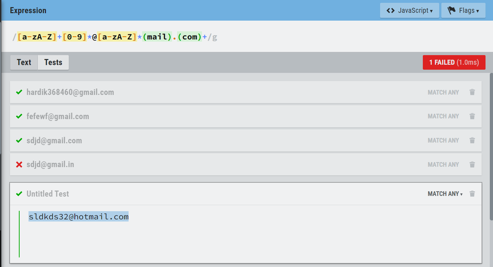

# Update : Please Find the JWT Authentication task submission below. 
JWT Task [here](https://github.com/Hardik7843/Assesment-of-Acumen-/blob/master/FinalTask/APITask/README.md#jwt-authentication-token)

Working of JWT Token explained [Here](https://github.com/Hardik7843/Assesment-of-Acumen-/blob/master/FinalTask/APITask/README.md#how-jwt-authentication-works)

# API Task Details.
The Django Server can be run using 

`python manage.py runserver`

This Assignment project has API to fetch data from CSV and Put into Database (`POST`)
And Has Another API to fetch those records from database. (`GET`)

In order to check APIs one has to Use tools like Postman or Django Rest Framework Interface.

Let's See the `GET` api.

1. After starting the server you will get the url of server in Terminal.
   like this -> Starting development server at `http://127.0.0.1:8000/.`

2. Go to this URL and see the response of `GET` api.
 
## Output 

Let's see the `POST` API.
1. Just add `/csv` to base url. to see the magic.
2. Now press the `POST` button on screen to post the request.

### Intitial Page

### After Posting the Request to server.

## Regular Expression for Emails

It checks the occurence of characters from (a-zA-Z). `+` sign check for atleast one occurence.

then check it sees wheter numbers [0-9] are present or not. `*` denotes zero or more time.

followed by check of `@` sign.
then it sees any charachter from alphabets. for example, `hot` or `g` etc(zero or more time).

then it checks for sequence `mail`

followed by `.` in mailid's

lastly `com` sequence.

`[a-zA-Z]+[0-9]*@[a-zA-Z]*(mail).(com)+`

#### Output

## ER - Diagram of Database.

# JWT Authentication token
## 1. Signup
### Creating User with Following username and password

### after the creation. we get his username,password and uniqeid.

## 2. Request for Login
### Sending the request for login, with user's credentials.

### The Response of Login request. The password will be encrypted here. the auth token will be provided.

### The server will also handle the request with wrong credentials.

### 3. Let's use the token given by response to login_req's in doing the actual login. 

### What if the token was fake

## How JWT Authentication works 

## Registration of user

<!-- ## To do 
2. Adding Company table with unique constraint.
3. Foreign Key and Primary Key for Employee and Company. -->