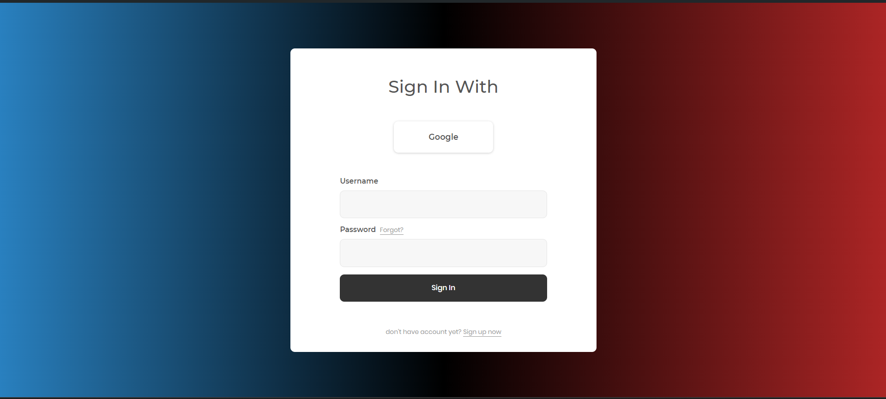

# Django Chat Application
Async Chat application with Django Channels, Websocket and JS (Ajax) 

## Features
- Login and Registration of User.
- ChatApp. with User Friendly Interface.

### Tasks to be Done
- Adding Gemini API with Google Authentication
- Addming ChatFeatures such as storing previous chats into databse.

---

### Usage :
-  For sending a one-time password via email, you should set your email and your email host password in 'EMAIL_HOST_USER' and 'EMAIL_HOST_PASSWORD' in 'settings.py' . Otherwise, sending the one-time password for user registration won't work.

```
git clone git@github.com:Hardik7843/Assesment-of-Acumen-.git
```

```
cd Final Task
```

```
cd django-chat-application
```

```
pip install -r requirements.txt
```

```
python manage.py migrate
```

```
python manage.py runserver
``` 

and see in `localhost:8000`
In another terminal, enter the following command to run celery

```
celery -A ChatApp worker -l info
```

you also need RabbitMQ as broker and Redis as backend

### Result
<p align="center">
  
</p>


<p align="center">
  
</p>

---
