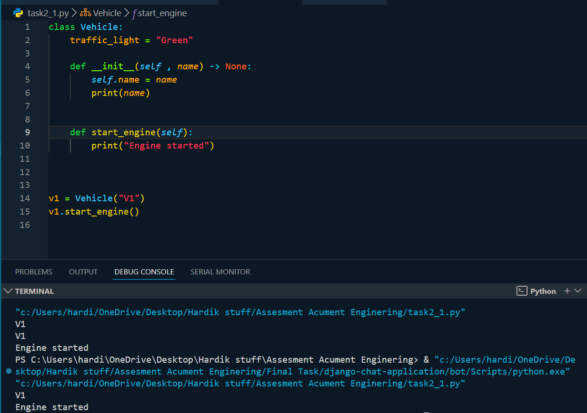

## Update: For Final Submission

Please find the `APItask` folder inside the `Final Task` folder. and Open
`README.md` over there. to understand the API task.

## Task 1
Assignment 1: Hello World Program
Objective:
Create a simple Python program to print "Hello, World!" to the console.
Instructions:
Open your preferred Python IDE or text editor.
Write a Python script that outputs the text "Hello, World!" to the console.
Save the file with a .py extension (e.g., hello_world.py).
Run the script to ensure it displays the correct output.

## Explanation

## Output

## Code 
`task1.py`

---

## Assignment 2: 

Demonstrating OOP Concepts in Python
Objective:
Create a Python program that demonstrates inheritance, polymorphism, and the use of global, module, object, and local variables using real-world classes.
Instructions:
Inheritance and Polymorphism:
Create a base class Vehicle with a method start_engine that prints "Engine started."
Create a derived class Car that inherits from Vehicle and overrides the start_engine method to print "Car engine started."
Create another derived class Bike that inherits from Vehicle and overrides the start_engine method to print "Bike engine started."
Global Variable:
Define a global variable traffic_light with the value "Green".
Module Variable:
Define a module-level variable speed_limit with the value 60.
Object Variable:
In the Car class, define an object variable make that stores the make of the car.
In the Bike class, define an object variable type that stores the type of bike.
Local Variable:
In each start_engine method, define a local variable message that stores the respective message to be printed

## Explanation
`task2_1.py` contains `Vehicle(base)` class consisting of consutructor (`__init__`) and `start_engine` methods. This `start_engine` method prints `"Engine started"`

## Output

## Code 
`task2.py`

## Task 3
Assignment 3: File Copy Script
Objective:
Create a Python script that copies all files from a source folder to a destination folder. The script should create the destination folder if it doesn't exist, handle errors gracefully, and provide appropriate messages.
Instructions:
Accept the source and destination folder paths as input from the user.
Check if the source folder exists. If not, print an error message and exit.
Create the destination folder if it doesn't exist.
Copy all files from the source folder to the destination folder.
Handle potential errors (e.g., permission issues, file not found) and provide appropriate error messages.
Print a success message if all files are copied successfully

## Output

## Code 
`task3.py`

